# JITMIND

<p align="center">
  
</p>

<p align="center">
  <b>Just-In-Time Memory Infrastructure for Agentic Systems</b><br/>
  Bi-temporal memory, self-editing lifecycle, graph semantics, hybrid retrieval fusion, and iterative research loops.
</p>

<p align="center">
  <a href="https://github.com/DivyamTalwar">
    <b>Author: Divyam Talwar</b>
  </a>
</p>

## Executive Summary

JITMIND is a memory-first runtime for AI agents that need durable knowledge, temporal correctness, and retrieval that works under real context pressure.

Most memory systems fail gradually for one of three reasons:

1. They only append new memories, so stale or wrong facts remain active forever.
2. They store time as metadata but do not enforce temporal validity during retrieval.
3. They optimize one retrieval mode (dense or sparse) and lose robustness on real query diversity.

JITMIND directly addresses these failure modes with:

- A self-editing memory lifecycle (`ADD`, `UPDATE`, `DELETE`, `NOOP`).
- A bi-temporal memory model (`t_created`, `t_observed`, `t_valid`, `t_invalid`, `t_expired`).
- A hybrid retrieval stack (BM25 + dense + index + graph) with RRF, dynamic weighting, tier-aware boosting, and optional reranking.
- A looped research process (plan -> search -> integrate -> reflect) instead of one-shot generation.
- Graph memory with entity semantics, provenance edges, and Personalized PageRank for associative recall.

This README is intentionally long and deep. It is meant to make a new contributor productive quickly, and to make an architecture reviewer confident that the system has real technical substance.

---

## Who This Repo Is For

- Agent framework developers who need long-horizon memory that does not rot.
- Applied AI engineers shipping production assistants with dynamic context limits.
- Researchers exploring memory quality under temporal drift and contradictory inputs.
- Platform teams that need explainable, provenance-aware retrieval instead of opaque embeddings only.

---

## What Exists Today

This repository currently includes:

- Core package: `jitmind/`
- Examples: `examples/quickstart/`
- Evaluation entrypoints: `eval/`
- Test suite (TTL-centric): `tests/`
- Visual assets and architecture SVGs: `assets/readme/`
- Packaging: `setup.py`

Notes on current state:

- Root `requirements.txt` is not present in this snapshot, so dependencies are installed explicitly.
- Test coverage is strongest for TTL/persistence behavior; broader end-to-end benchmark automation is present as evaluation entrypoints and should be extended per deployment needs.

---

## Table of Contents

1. [Visual Identity and Embedded Assets](#visual-identity-and-embedded-assets)
2. [System Thesis and Design Principles](#system-thesis-and-design-principles)
3. [High-Level Architecture](#high-level-architecture)
4. [End-to-End Lifecycle](#end-to-end-lifecycle)
5. [Data Contracts and Schemas](#data-contracts-and-schemas)
6. [Memory Write Path Deep Dive](#memory-write-path-deep-dive)
7. [Research Path Deep Dive](#research-path-deep-dive)
8. [Bi-Temporal Semantics and Temporal Filtering](#bi-temporal-semantics-and-temporal-filtering)
9. [Self-Editing Memory and Conflict Resolution](#self-editing-memory-and-conflict-resolution)
10. [Hierarchical Tiers and Decay Mechanics](#hierarchical-tiers-and-decay-mechanics)
11. [Retrieval, Fusion, and Ranking Math](#retrieval-fusion-and-ranking-math)
12. [Graph Memory and Knowledge Semantics](#graph-memory-and-knowledge-semantics)
13. [Ingestion Pipeline and Document Processing](#ingestion-pipeline-and-document-processing)
14. [User Profile Modeling](#user-profile-modeling)
15. [Maintenance Jobs: Consolidation and Summarization](#maintenance-jobs-consolidation-and-summarization)
16. [Reliability: Async, Checkpointing, Replay](#reliability-async-checkpointing-replay)
17. [Evaluation and Testing](#evaluation-and-testing)
18. [Configuration Reference](#configuration-reference)
19. [Repository Structure](#repository-structure)
20. [Quickstart](#quickstart)
21. [Operational Playbook for Production](#operational-playbook-for-production)
22. [Performance Tuning Guide](#performance-tuning-guide)
23. [Known Gaps and Recommended Next Steps](#known-gaps-and-recommended-next-steps)
24. [FAQ](#faq)
25. [Citation](#citation)

---

## Visual Identity and Embedded Assets

### Storyboard Frames

All frames below use the same visual language: light background, controlled accent colors, and high-legibility technical composition.

<p align="center">
  
  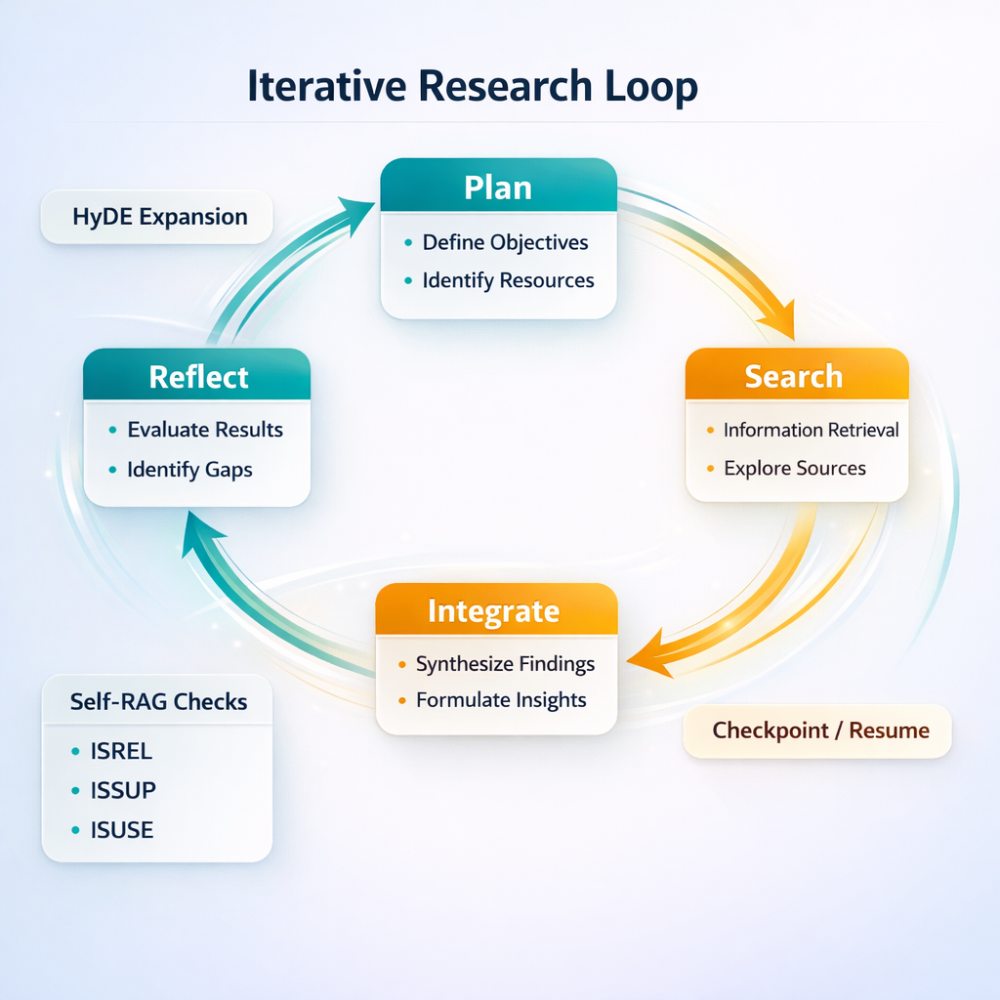
  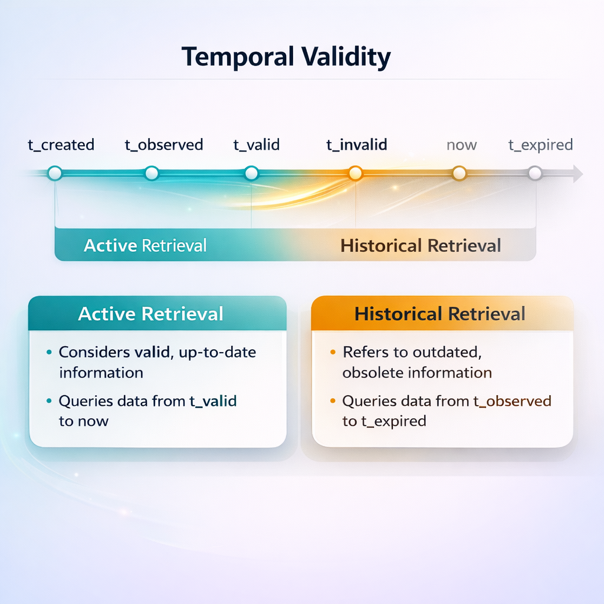
</p>

<p align="center">
  
  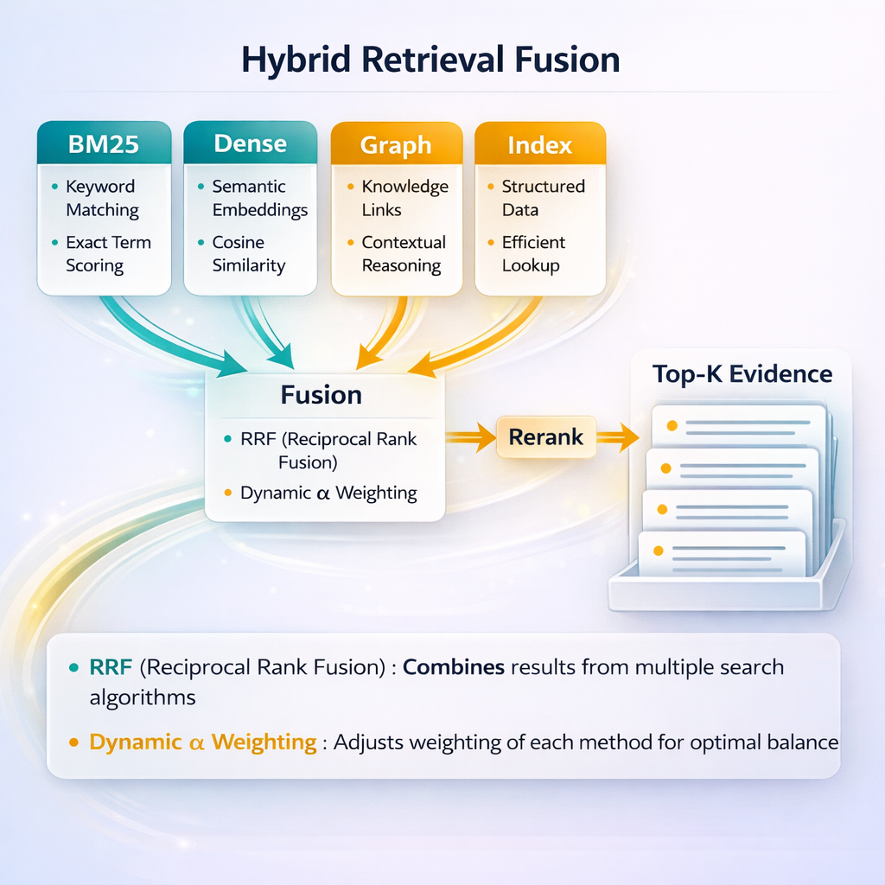
  
</p>

### Animated Architecture SVG Pack

1. System overview  
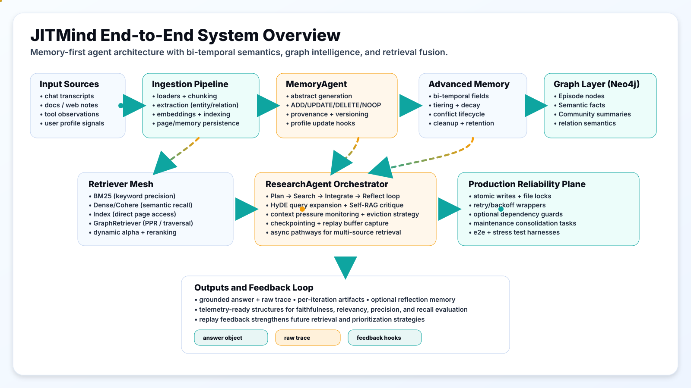

2. Request lifecycle  
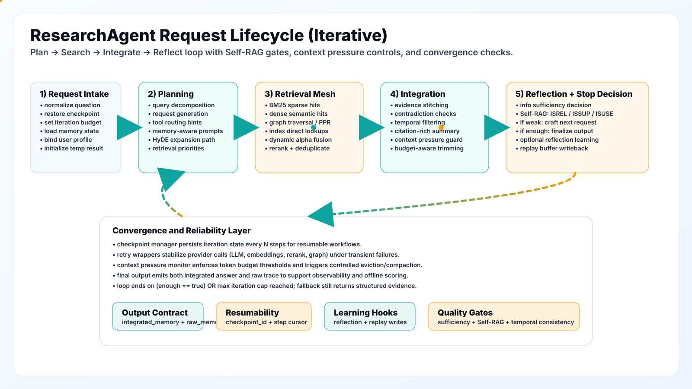

3. Memory lifecycle  
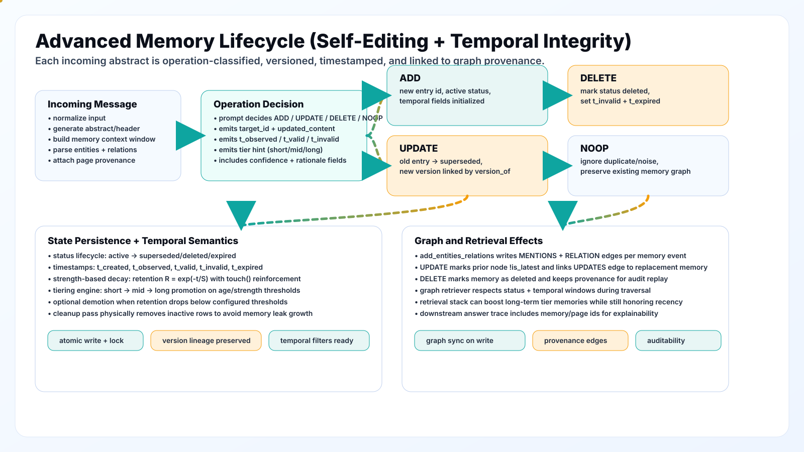

4. Bi-temporal model  
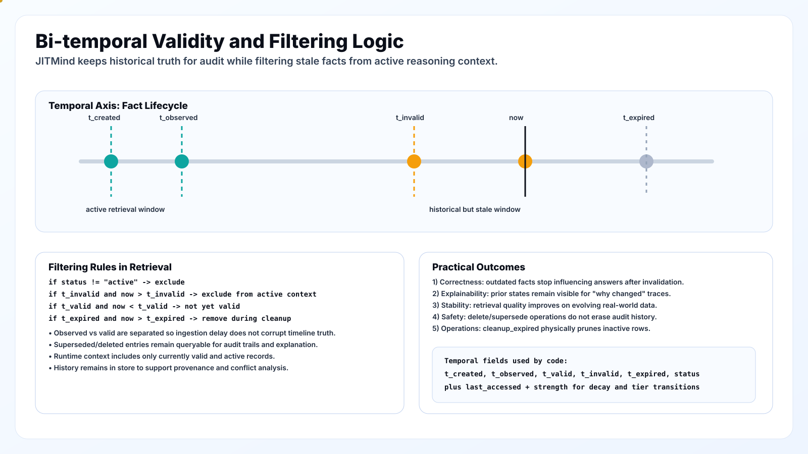

5. Retrieval fusion  
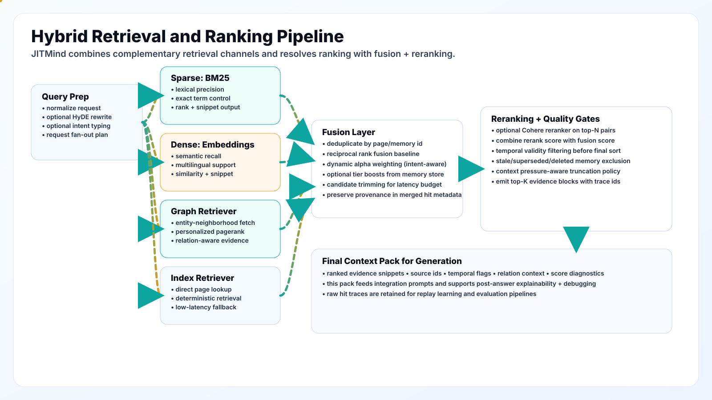

6. Graph memory 3-tier view  
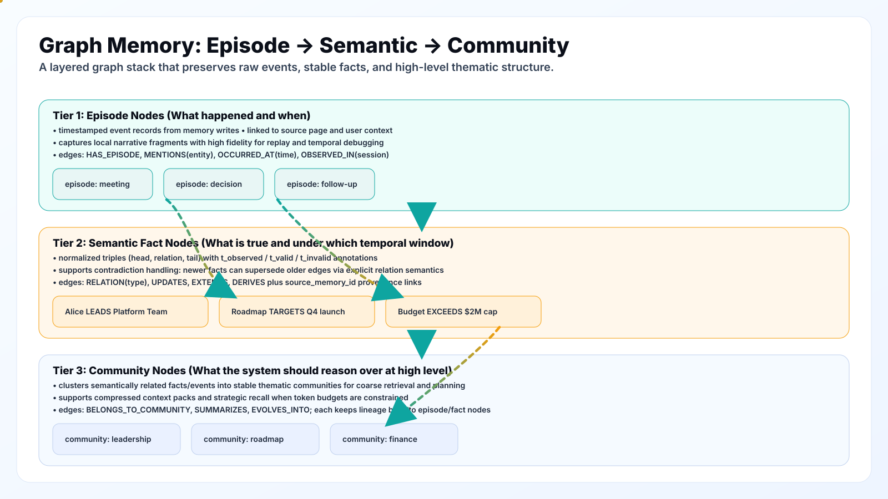

7. Ingestion pipeline  
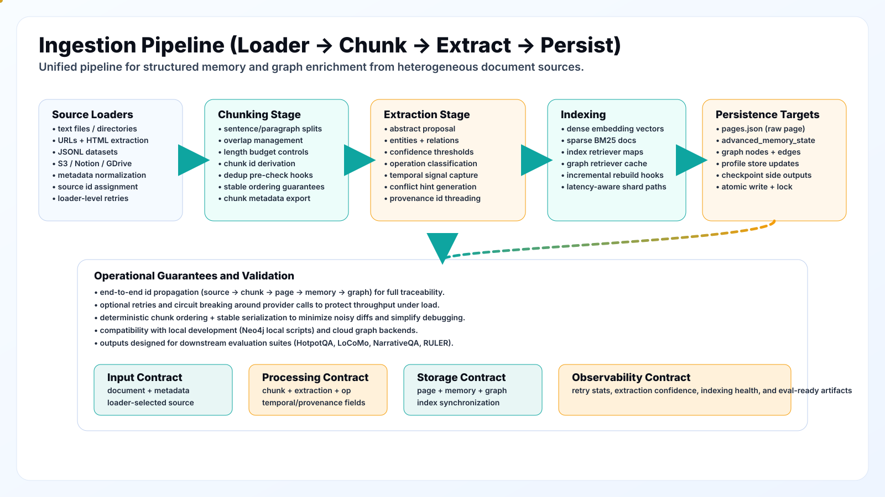

8. Capability map  
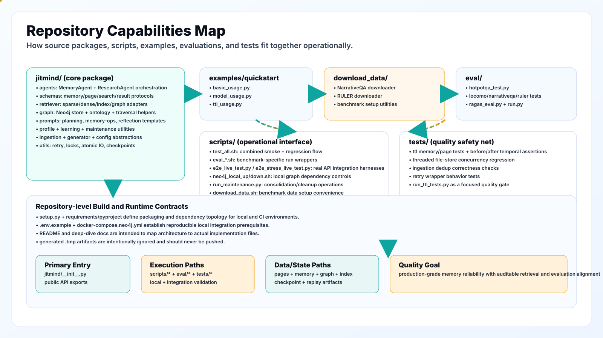

---

## System Thesis and Design Principles

### Thesis

Agent memory must be treated as a managed information system, not a passive log.  
That means every new fact can impact old facts, retrieval must be time-aware, and context assembly must be adaptive under token pressure.

### Design Principles

1. Memory is mutable but auditable.
   - Updates create versions instead of silent overwrite.
   - Deletions and supersession are explicit lifecycle states.

2. Time is first-class.
   - Retrieval must respect validity windows, not just insertion order.

3. Retrieval must be plural.
   - Sparse handles lexical precision.
   - Dense handles semantic proximity.
   - Graph handles relational and associative reasoning.

4. Ranking is compositional, not single-score.
   - Fusion + tier weighting + reranking + temporal gating.

5. Reasoning is iterative.
   - Plan, search, integrate, critique, refine.

6. Operational reliability matters.
   - Checkpoints, async path, replay buffer, file locks, atomic writes.

---

## High-Level Architecture

JITMIND has two core actors:

- `MemoryAgent` for write-time intelligence.
- `ResearchAgent` for read-time intelligence.

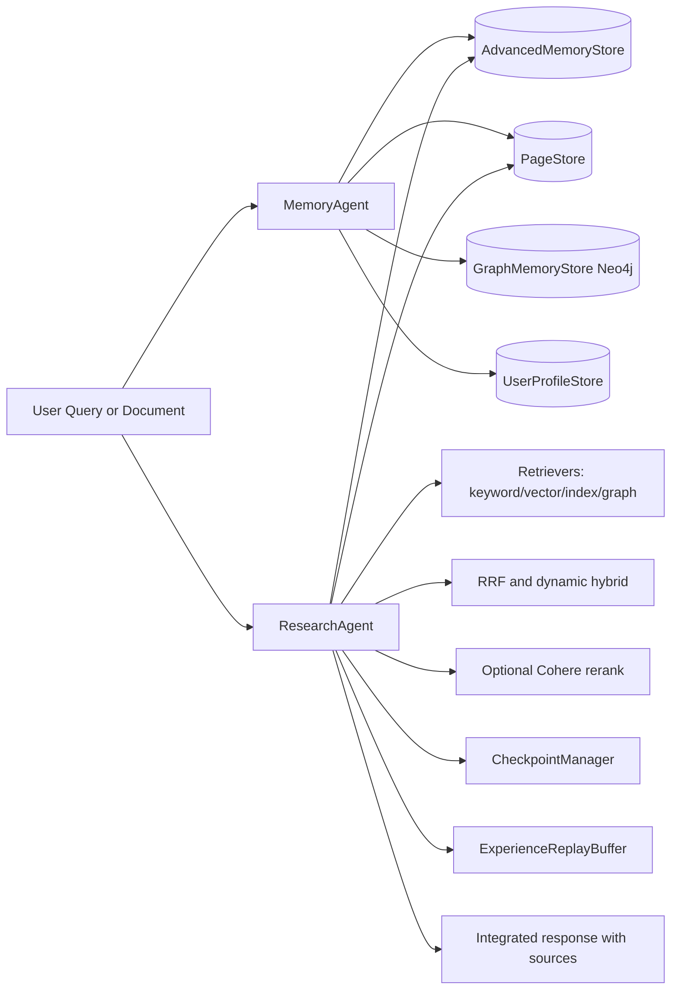

### Why split write and read intelligence

- Write-time and read-time objectives are different.
  - Write-time: normalize, compress, version, preserve provenance.
  - Read-time: maximize question-specific relevance under budget and latency constraints.
- Separating concerns keeps each path tunable without collapsing into prompt spaghetti.

---

## End-to-End Lifecycle

### Write lifecycle

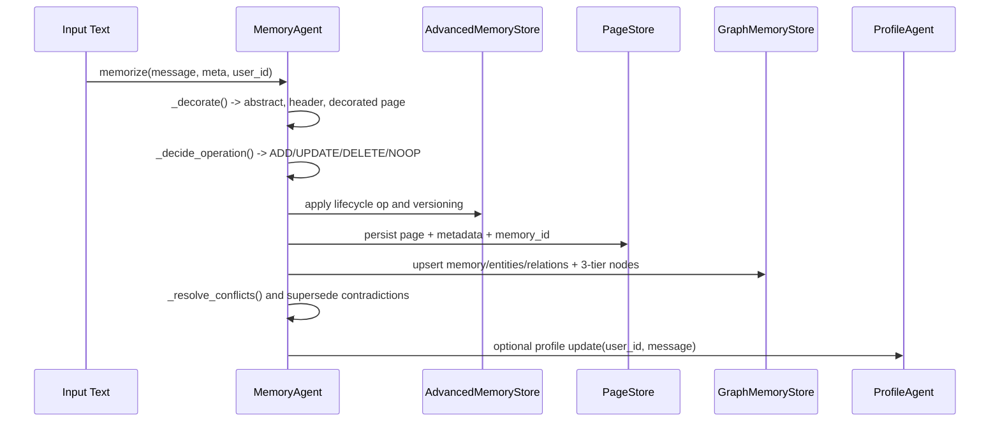

### Research lifecycle

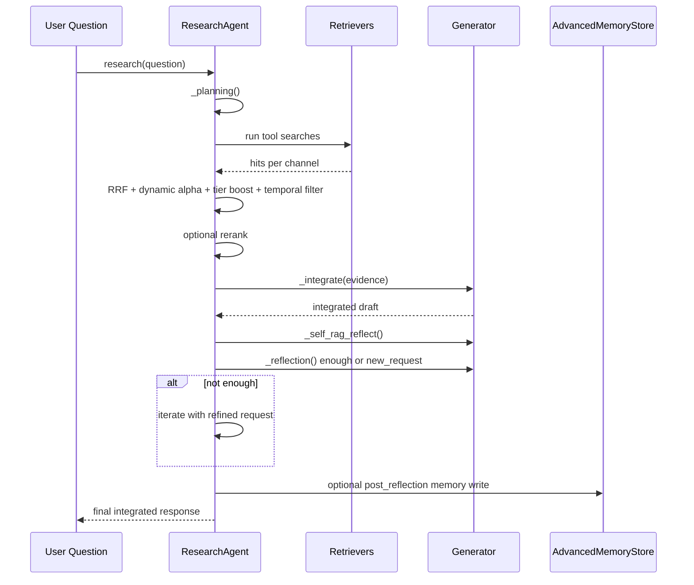

---

## Data Contracts and Schemas

### Memory contracts

- `MemoryEntry` in `jitmind/schemas/advanced_memory.py`
- `AdvancedMemoryState`
- Compatibility bridge to `MemoryState` (`abstracts: List[str]`)

### Page contracts

- `Page` in `jitmind/schemas/page.py`
- Metadata in pages carries important linkage fields:
  - `page_id`
  - `memory_id`
  - `t_observed`
  - `t_valid`
  - `t_invalid`
  - source/chunk fields from ingestion

### Research contracts

- `SearchPlan` with:
  - `info_needs`
  - `tools`
  - `keyword_collection`
  - `vector_queries`
  - `page_index`
  - `graph_queries`
- `Hit` with:
  - `page_id`
  - `snippet`
  - `source`
  - scoring metadata
- `Result` and `ResearchOutput` for integrated memory and raw iteration trace.

---

## Memory Write Path Deep Dive

File: `jitmind/agents/memory_agent.py`

### Step 1: Decorate input

`_decorate(message, memory_state)` builds context from existing memory abstracts and asks the generator to produce a concise abstract for the new message.

Output:

- `abstract`
- `header`
- `decorated_new_page`

### Step 2: Decide operation

`_decide_operation(new_abstract, new_message)` calls the model with a structured schema to choose:

- `operation`: `add`, `update`, `delete`, `noop`
- temporal fields (`t_observed`, `t_valid`, `t_invalid`)
- tier/importance hint
- target IDs for updates/deletes
- extracted entities/relations for graph update

### Step 3: Apply operation

`_apply_memory_operation(...)` translates decision into store actions:

- `add`: new `MemoryEntry` added.
- `update`: prior entry marked superseded, new version appended.
- `delete`: target entry marked deleted.
- `noop`: no new entry.

### Step 4: Persist page

A `Page` is always persisted for traceability, with metadata linking back to memory and temporal hints.

### Step 5: Graph synchronization

If Neo4j is configured:

- Upsert `Memory` node.

- Upsert entity nodes and relation edges.

- Add 3-tier graph artifacts:
  - `Episode` node for event-level record.
  - `Semantic` fact nodes from extracted relations or fallback statement.
  - optional `Community` links from later consolidation/summarization flows.

### Step 6: Conflict resolution

`_resolve_conflicts()`:

- queries graph for nearby related memories
- checks contradiction via LLM prompt
- supersedes contradictory old memories (newer observation wins)

### Step 7: Optional profile update

If profile agent is enabled and `user_id` is provided, profile dimensions are updated from the message.

---

## Research Path Deep Dive

File: `jitmind/agents/research_agent.py`

### Runtime controls

Constructor supports major switches:

- `enable_hyde`
- `enable_self_rag`
- `enable_dynamic_alpha`
- `enable_reflection_learning`
- `reranker` and score weighting
- context pressure controls (`max_context_tokens`, `context_warning_threshold`)
- checkpointing and replay buffer dependencies

### Planning

`_planning(request, memory_state)` builds a schema-constrained search plan using:

- request text
- ranked/trimmed memory context
- optional user profile context

### Search execution

`_search(plan, result, question)`:

1. Runs planned tools.
2. Optionally adds HyDE-generated pseudo document to vector queries.
3. Collects per-tool hits and scores.
4. Computes RRF across channels.
5. Computes dynamic dense/sparse hybrid score when applicable.
6. Applies tier and retention multiplier from memory store.
7. Applies temporal filtering.
8. Applies optional reranking.
9. Integrates evidence via LLM.

### Reflection and iterative refinement

Two critics are used:

- Self-RAG critic (`ISREL`, `ISSUP`, `ISUSE`) to validate relevance/support/utility.
- Sufficiency reflection (`_reflection`) to decide:
  - `enough=True` -> stop
  - `enough=False` -> generate next request and continue iteration

### Post-answer learning

When enabled:

- `post_reflection()` writes procedural insight back into long-term memory.
- replay buffer stores query/retrieval/response/feedback tuples.

### Async path

`research_async(...)` mirrors sync behavior with parallel tool calls and thread offloading for heavy sync functions.

---

## Bi-Temporal Semantics and Temporal Filtering

### Why bi-temporal

Two different clocks exist in memory systems:

1. System clock: when your system learned something.
2. World clock: when that fact is true in the domain.

If you only store one timestamp, you cannot reliably reason about corrections, delayed evidence, or retroactive events.

### Temporal fields in practice

| Field | Meaning |
|---|---|
| `t_created` | When JITMIND persisted the memory |
| `t_observed` | When evidence was observed/recorded |
| `t_valid` | Start of factual validity window |
| `t_invalid` | End of factual validity window |
| `t_expired` | Internal lifecycle expiry timestamp |

### Retrieval-time temporal gating

`_filter_temporal_hits()` drops hits when:

- `t_valid` is in the future (not yet valid).
- `t_invalid` is in the past or now (already invalid).

Result:

- historical traces stay in storage,
- but stale facts do not pollute active reasoning.

---

## Self-Editing Memory and Conflict Resolution

### Why append-only fails

Append-only memory silently accumulates contradictions. Retrieval then randomly surfaces old and new facts together.

### JITMIND lifecycle strategy

- Every write has an explicit operation decision.
- Updates create new versions and supersede old entries.
- Deletions preserve record lineage via state transitions.
- No-op avoids memory inflation from duplicate statements.

### Conflict policy

Conflict resolution uses:

1. graph neighborhood lookup for related memories,
2. contradiction classification prompt,
3. supersede old memory with `t_invalid = new.t_observed` on conflict.

This yields deterministic state transitions even when input stream is noisy.

---

## Hierarchical Tiers and Decay Mechanics

File: `jitmind/schemas/advanced_memory.py`

### Tiers

- `short`: recent or unproven value
- `mid`: reinforced and retained
- `long`: durable and high-value

### Promotion and demotion

Promotion depends on combinations of:

- age
- strength (recall reinforcement)

Demotion depends on:

- inactivity
- retention score under configured thresholds

### Decay model

Retention score:

`R = exp(-t / S)`

where:

- `t` is time since last access (in days)
- `S` is memory strength

This keeps repeatedly useful memories alive and naturally fades cold ones.

### Cleanup behavior

`cleanup_expired()` marks and purges non-active records to avoid unbounded memory growth.

---

## Retrieval, Fusion, and Ranking Math

### Retrieval channels

- Keyword search:
  - BM25 (Pyserini/Lucene), file `jitmind/retriever/bm25.py`
- Dense semantic search:
  - Cohere embeddings + FAISS, file `jitmind/retriever/cohere_dense.py`
- Page index lookup:
  - direct index path, file `jitmind/retriever/index_retriever.py`
- Graph retrieval:
  - graph queries + PPR mode, file `jitmind/retriever/graph_retriever.py`

### Fusion strategy

Reciprocal Rank Fusion per item:

`RRF(item) = sum(1 / (k + rank_i + 1))`

where `i` iterates retrieval channels.

### Dynamic hybrid score

For query-dependent dense/sparse blending:

`Hybrid = alpha * dense + (1 - alpha) * sparse`

`alpha` is heuristic from query traits:

- short, lexical, symbol-heavy query -> lower alpha
- long semantic query -> higher alpha

### Tier and retention boost

Base score is multiplied by memory quality:

`Boosted = BaseScore * TierWeight * Retention`

with default tier weights:

- long: 1.5
- mid: 1.2
- short: 1.0

### Optional reranking

Cohere reranker score is merged with fused score:

`Final = Boosted + rerank_weight * rerank_score`

---

## Graph Memory and Knowledge Semantics

Files:

- `jitmind/graph/graph_store.py`
- `jitmind/graph/ontology.py`
- `jitmind/graph/utils.py`

### Node inventory

- `Memory`
- `Entity`
- `Episode`
- `Semantic`
- `Community`

### Edge inventory

- `MENTIONS`
- `RELATION` (with semantic type in relationship property)
- `HAS_EPISODE`
- `HAS_SEMANTIC`
- `HAS_COMMUNITY`
- `HAS_MEMBER`
- `DERIVES`
- version/provenance edges (`UPDATES`, `EXTENDS`)

### Graph CRUD surface

Entity operations:

- `upsert_entity`
- `delete_entity`

Relation operations:

- `upsert_relation`
- `delete_relation`

Memory graph object operations:

- `delete_memory`
- `delete_episode`
- `delete_semantic`
- `delete_community`

### Associative retrieval via Personalized PageRank

`personalized_pagerank(entity_names, damping, depth, max_iter, limit)`:

1. Builds a bounded subgraph around seed entities.
2. Propagates probability mass from seed set.
3. Ranks memory nodes by converged scores.
4. Returns active memory hits with scores.

This is especially useful for multi-hop association where keyword/dense retrieval misses latent relational paths.

---

## Ingestion Pipeline and Document Processing

File: `jitmind/ingestion/pipeline.py`

### Ingestion capabilities

- loader fan-in (`ingest_loaders`)
- chunking abstraction via `BaseChunker`
- deduplication by SHA256 content hash
- metadata propagation to page records
- direct handoff into `MemoryAgent.memorize()`

### Supported loader classes

From `jitmind/ingestion/loaders.py`:

- `TextFileLoader`
- `DirectoryLoader`
- `URLLoader`
- `JSONLLoader`
- `S3Loader`
- `NotionLoader`
- `GDriveLoader`

### Why this matters

High-quality memory is mostly an ingestion problem:

- stable chunking
- deterministic metadata
- dedup controls
- source traceability

If this layer is weak, downstream retrieval quality collapses regardless of model quality.

---

## User Profile Modeling

Files:

- `jitmind/profile/profile_agent.py`
- `jitmind/profile/profile_store.py`

### Profile shape

- `static`: durable personal facts/preferences
- `dynamic`: short-horizon situational signals
- `traits`: long-horizon behavior descriptors

### Update path

`UserProfileAgent.update_profile(user_id, message)`:

1. prompts model for structured updates
2. merges updates into persisted per-user JSON profile
3. profile context can be injected into planning context by `ResearchAgent`

This enables better personalization without polluting global memory graph semantics.

---

## Maintenance Jobs: Consolidation and Summarization

### Memory consolidation

File: `jitmind/maintenance/consolidation.py`

Flow:

1. collect active short-term entries
2. embed with Cohere
3. cluster by similarity threshold
4. summarize cluster into merged mid-tier entry
5. supersede source entries

Purpose:

- reduce redundancy
- preserve signal density
- keep retrieval context budget healthy

### Hierarchical summarization (RAPTOR-style)

File: `jitmind/summarization/raptor.py`

Flow:

- Level 0: raw entries
- Level 1: cluster summaries
- Level 2: summary of summaries
- Level 3: global summary node

Purpose:

- long-context compression
- topic hierarchy formation
- cheap high-level recall for planning context

---

## Reliability: Async, Checkpointing, Replay

### Async execution

- `research_async()` supports async orchestration for multi-tool retrieval paths.

### Checkpointing

File: `jitmind/utils/checkpoint.py`

Capabilities:

- save state by thread/checkpoint id
- load state for resume
- list and delete checkpoints
- atomic JSON persistence with lock files

### Replay buffer

File: `jitmind/learning/replay_buffer.py`

Capabilities:

- append experience tuples
- sample mini-batches for offline analysis or future continual-learning loops

---

## Evaluation and Testing

### Evaluation entrypoints

- `eval/run.py` provides task dispatch CLI behavior.
- `eval/ragas_eval.py` re-exports evaluator wrapper.
- `jitmind/evaluation/ragas_eval.py` contains evaluator implementation.

If installed through package entrypoints:

```bash
jitmind-eval --help
jitmind-eval hotpotqa --help
jitmind-eval locomo --help
jitmind-eval narrativeqa --help
jitmind-eval ruler --help
```

### Current test suite in repo

TTL-focused tests are present:

- `tests/test_ttl_memory.py`
- `tests/test_ttl_page.py`
- `tests/test_ttl_standalone.py`
- `tests/test_ttl_before_after.py`
- `tests/run_ttl_tests.py`

Run all:

```bash
python3 -m pytest tests -v
```

### What to add next for stronger production confidence

Recommended additional test layers:

1. Contract tests for `MemoryAgent` operation decisions.
2. Temporal filtering tests over synthetic time windows.
3. Graph CRUD and PPR regression tests with seeded Neo4j test db.
4. End-to-end retrieval fusion tests with deterministic fixture corpora.
5. Async checkpoint resume tests under interrupted run simulation.

---

## Configuration Reference

Environment variables discovered from implementation:

| Variable | Used in | Purpose |
|---|---|---|
| `OPENROUTER_API_KEY` | generator | OpenRouter auth key |
| `OPENROUTER_BASE_URL` | generator | OpenRouter base URL |
| `OPENAI_API_KEY` | generator fallback | OpenAI-compatible auth fallback |
| `OPENAI_BASE_URL` | generator fallback | OpenAI-compatible base URL fallback |
| `COHERE_API_KEY` | dense/rerank/summarization/consolidation | Cohere auth key |
| `COHERE_BASE_URL` | dense/rerank | Cohere base URL |
| `COHERE_EMBED_MODEL` | dense retriever | embedding model id |
| `COHERE_EMBED_INPUT_TYPE_DOC` | dense retriever | doc embedding input type |
| `COHERE_EMBED_INPUT_TYPE_QUERY` | dense retriever | query embedding input type |
| `COHERE_RERANK_MODEL` | reranker | rerank model id |
| `NEO4J_URI` | memory/research auto graph wiring | Neo4j URI |
| `NEO4J_USERNAME` | memory/research auto graph wiring | Neo4j username |
| `NEO4J_PASSWORD` | memory/research auto graph wiring | Neo4j password |
| `NEO4J_DATABASE` | memory/research auto graph wiring | Neo4j database name |
| `GRAPH_ENTITY_TYPES` | ontology loader | allow-list entity types |
| `GRAPH_RELATION_TYPES` | ontology loader | allow-list relation types |
| `GRAPH_ALLOW_UNKNOWN` | ontology loader | unknown type behavior |

### Core constructor knobs worth tuning

`ResearchAgent`:

- `max_iters`
- `rrf_k`
- `rerank_top_n`
- `rerank_weight`
- `enable_hyde`
- `enable_self_rag`
- `enable_dynamic_alpha`
- `enable_reflection_learning`
- `max_context_tokens`
- `context_warning_threshold`

`AdvancedMemoryStore`:

- `ttl_seconds`
- `retention_threshold`
- promotion thresholds (`short_to_mid_*`, `mid_to_long_*`)
- demotion controls

---

## Repository Structure

```text
.
|-- assets/
|   |-- logo.png
|   `-- readme/
|       |-- final_svgs/
|       |-- theme_samples/
|       |-- theme_samples_light/
|       `-- Images/
|-- download_data/
|-- eval/
|-- examples/
|   `-- quickstart/
|-- jitmind/
|   |-- agents/
|   |-- config/
|   |-- evaluation/
|   |-- generator/
|   |-- graph/
|   |-- ingestion/
|   |-- learning/
|   |-- maintenance/
|   |-- profile/
|   |-- prompts/
|   |-- retriever/
|   |-- schemas/
|   |-- summarization/
|   `-- utils/
|-- tests/
|-- setup.py
`-- README.md
```

---

## Quickstart

### 1) Create virtual environment

```bash
python3 -m venv .venv
source .venv/bin/activate
python3 -m pip install --upgrade pip
```

### 2) Install package and dependencies

Because `requirements.txt` is not present in this snapshot, install runtime dependencies explicitly:

```bash
pip install -e .
pip install openai cohere neo4j faiss-cpu numpy pydantic tqdm scikit-learn pytest
```

Optional sparse retriever dependency:

```bash
pip install pyserini
```

### 3) Export environment variables

```bash
export OPENROUTER_API_KEY="..."
export OPENROUTER_BASE_URL="https://openrouter.ai/api/v1"

export COHERE_API_KEY="..."
export COHERE_BASE_URL="https://api.cohere.com"

export NEO4J_URI="neo4j+s://<instance>.databases.neo4j.io"
export NEO4J_USERNAME="neo4j"
export NEO4J_PASSWORD="..."
export NEO4J_DATABASE="neo4j"
```

Optional: local Neo4j (recommended for development)

```bash
./scripts/neo4j_local_up.sh
```

Then point JITMIND at your local graph:

```bash
export NEO4J_URI="bolt://localhost:7687"
export NEO4J_USERNAME="neo4j"
export NEO4J_PASSWORD="jitmind_local_password"  # default local password; override via NEO4J_PASSWORD
export NEO4J_DATABASE="neo4j"
```

Stop local Neo4j:

```bash
./scripts/neo4j_local_down.sh
```

### 4) Minimal end-to-end example

```python
import os
from jitmind import (
    MemoryAgent,
    ResearchAgent,
    OpenAIGenerator,
    OpenAIGeneratorConfig,
    AdvancedMemoryStore,
    InMemoryPageStore,
    IndexRetriever,
    IndexRetrieverConfig,
    BM25Retriever,
    BM25RetrieverConfig,
    CohereDenseRetriever,
    CohereEmbedRetrieverConfig,
    CohereReranker,
    CohereRerankerConfig,
)

generator = OpenAIGenerator.from_config(
    OpenAIGeneratorConfig(
        model_name="google/gemini-3-flash-preview",
        api_key=os.getenv("OPENROUTER_API_KEY"),
        base_url=os.getenv("OPENROUTER_BASE_URL", "https://openrouter.ai/api/v1"),
        temperature=0.0,
        max_tokens=512,
    )
)

memory_store = AdvancedMemoryStore()
page_store = InMemoryPageStore()

memory_agent = MemoryAgent(
    generator=generator,
    memory_store=memory_store,
    page_store=page_store,
)

memory_agent.memorize("Alice moved to Berlin in 2024.", user_id="alice")
memory_agent.memorize("Alice now works at Orbital Systems as an engineer.", user_id="alice")
memory_agent.memorize("Alice previously worked at Nova Labs.", user_id="alice")

retrievers = {}

index_retriever = IndexRetriever(IndexRetrieverConfig(index_dir="./index/index").__dict__)
index_retriever.build(page_store)
retrievers["page_index"] = index_retriever

try:
    bm25_retriever = BM25Retriever(BM25RetrieverConfig(index_dir="./index/bm25").__dict__)
    bm25_retriever.build(page_store)
    retrievers["keyword"] = bm25_retriever
except Exception as e:
    print("BM25 disabled:", e)

try:
    dense_retriever = CohereDenseRetriever(
        CohereEmbedRetrieverConfig(
            index_dir="./index/cohere_dense",
            api_key=os.getenv("COHERE_API_KEY"),
        ).__dict__
    )
    dense_retriever.build(page_store)
    retrievers["vector"] = dense_retriever
except Exception as e:
    print("Dense disabled:", e)

reranker = None
try:
    reranker = CohereReranker(CohereRerankerConfig(api_key=os.getenv("COHERE_API_KEY")).__dict__)
except Exception as e:
    print("Reranker disabled:", e)

research_agent = ResearchAgent(
    page_store=page_store,
    memory_store=memory_store,
    retrievers=retrievers,
    generator=generator,
    reranker=reranker,
    max_iters=3,
    enable_hyde=True,
    enable_self_rag=True,
    enable_dynamic_alpha=True,
    enable_reflection_learning=True,
)

out = research_agent.research(
    request="Where does Alice work now, and what changed compared to before?",
    user_id="alice",
)

print(out.integrated_memory)
print(out.raw_memory.keys())
```

### 5) Run included examples

```bash
python3 examples/quickstart/basic_usage.py
python3 examples/quickstart/model_usage.py
python3 examples/quickstart/ttl_usage.py
```

### 6) Run tests (unit + optional live E2E)

```bash
./scripts/test_all.sh
```

Optional heavier live stress harness:

```bash
python3 scripts/e2e_stress_live_test.py
```

---

## Operational Playbook for Production

### Deployment profiles

Local development profile:

- OpenRouter for generation.
- Cohere for embeddings/reranking.
- local or Aura Neo4j.
- filesystem stores for memory, pages, profiles, checkpoints.

Cloud production profile:

- managed Neo4j Aura.
- externalized storage for artifacts/checkpoints.
- key vault for secrets.
- observability layer around latency and retrieval quality.

### Suggested observability metrics

Memory quality:

- operation distribution (`add/update/delete/noop`)
- conflict supersede count
- active vs expired memory counts
- tier distribution over time

Retrieval quality:

- per-channel hit contribution
- average RRF spread
- reranker impact delta
- temporal filter drop-rate

Runtime:

- p50/p95 planning latency
- p50/p95 retrieval latency by channel
- p50/p95 integration latency
- iteration count distribution
- checkpoint resume success rate

### Data governance checklist

- never log raw secrets
- redact PII from telemetry payloads
- protect profile files and checkpoint files
- encrypt persistent stores where required
- implement retention policy for profile and replay artifacts

---

## Performance Tuning Guide

### If latency is too high

1. Reduce `max_iters`.
2. Disable reranker or lower `rerank_top_n`.
3. Disable HyDE if query expansion cost is high.
4. Keep graph depth small in `GraphRetriever`.
5. Lower retrieval `top_k`.

### If answer quality is weak

1. Keep HyDE enabled.
2. Keep Self-RAG enabled to force evidence checks.
3. Increase `max_iters` moderately.
4. Enable reranker and tune `rerank_weight`.
5. Improve ingestion chunking and metadata quality.

### If memory grows too fast

1. tighten `retention_threshold`
2. enable stronger consolidation cadence
3. reduce noise with better `NOOP` decision prompts
4. tune promotion thresholds to avoid over-promotion

### If stale facts leak into answers

1. validate `t_valid` and `t_invalid` extraction quality
2. verify temporal fields are attached in page metadata
3. inspect `_filter_temporal_hits` behavior with fixture tests
4. increase conflict resolution coverage

---

## Known Gaps and Recommended Next Steps

Current implementation is strong in architecture depth, but the following improvements would make it even more production-complete:

1. Add a formal root dependency manifest (`requirements.txt` or `pyproject.toml`) for one-command install parity.
2. Expand automated tests beyond TTL:
   - memory op contracts
   - retrieval fusion regression
   - graph PPR behavior
   - async checkpoint resume
3. Add explicit benchmark harness scripts for repeatable public scorecards with pinned configs.
4. Add migration tooling for schema evolution if memory files need backward compatibility over many versions.
5. Add service wrappers (REST/gRPC) if this repo is to be consumed as a deployed backend, not only a library.

---

## FAQ

### Is JITMIND only a graph memory system?

No. Graph is one channel. The system is intentionally hybrid: dense + sparse + index + graph.

### Does JITMIND support append-only mode?

You can emulate append-only behavior, but the system is designed for lifecycle edits because append-only memory decays in quality over time.

### Why keep both memory store and page store?

`MemoryEntry` is normalized memory state. `Page` is provenance-rich source context. Keeping both lets retrieval and auditing remain transparent.

### Is Neo4j mandatory?

No. If Neo4j environment variables are absent, graph features are skipped and non-graph retrieval channels still operate.

### Is this OpenAI-only?

No. Generation is OpenAI-compatible API based, with OpenRouter defaults and vLLM compatibility in the generator layer.

---

## Additional Documentation in This Repo

- `IMPLEMENTATION_DEEP_DIVE.md`
- `IMPLEMENTATION_DEEP_DIVE_V2.md`
- `LAUNCH_TEASERS.md`
- `LAUNCH_POSTS.md`
- `LINKEDIN_TRAILER_SERIES.md`

---

## Author

Divyam Talwar  
`github.com/DivyamTalwar`
