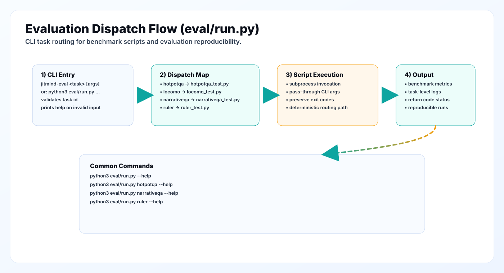

# Evaluation Directory

This folder provides evaluation entrypoints and wrappers for benchmark execution.



## Files

- `run.py`
  - CLI task dispatcher used by `jitmind-eval` console entrypoint.
  - routes a task name to a benchmark script in this folder.
- `ragas_eval.py`
  - package-level evaluator re-export (`jitmind.evaluation.ragas_eval`).

## How `run.py` Works

`run.py` expects task scripts in the same folder and maps:

- `hotpotqa` -> `hotpotqa_test.py`
- `locomo` -> `locomo_test.py`
- `narrativeqa` -> `narrativeqa_test.py`
- `ruler` -> `ruler_test.py`

It then forwards remaining CLI arguments to that script via subprocess.

## Current repository snapshot

The repository includes task scripts for HotpotQA, LoCoMo, NarrativeQA, and
RULER. Install evaluation dependencies before running them:

```bash
pip install -e ".[eval]"
python3 eval/run.py hotpotqa
python3 eval/run.py locomo
python3 eval/run.py narrativeqa
python3 eval/run.py ruler
```

Recommended command style:

```bash
python3 eval/run.py <task> [task-specific-args...]
```

or, if package entrypoint is installed:

```bash
jitmind-eval <task> [task-specific-args...]
```

## Best Practices

1. Keep dataset versions explicit and pinned in benchmark scripts.
2. Emit machine-readable results (JSON/CSV) alongside logs.
3. Capture model/retriever config in output metadata for reproducibility.
4. Use fixed seeds where randomness impacts metrics.
