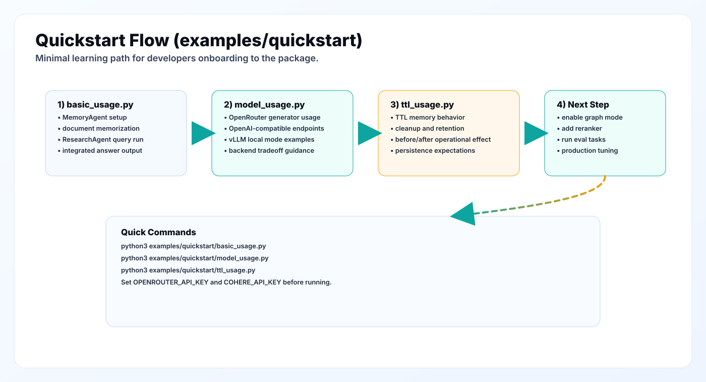

# Quickstart Examples

This directory contains runnable onboarding examples for the JITMIND package.



## Files

### `basic_usage.py`

Demonstrates:

- generator setup
- `MemoryAgent` usage
- memory population via `memorize()`
- `ResearchAgent` usage with retrievers
- integrated answer output

### `model_usage.py`

Demonstrates:

- model backend selection patterns
- OpenRouter/OpenAI-compatible setup
- local vLLM-compatible setup

### `ttl_usage.py`

Demonstrates:

- TTL memory/page behavior
- cleanup effects and retention behavior

## Prerequisites

From repository root:

```bash
python3 -m venv .venv
source .venv/bin/activate
pip install -e .
pip install openai cohere neo4j faiss-cpu numpy pydantic tqdm scikit-learn pytest
```

Optional sparse retrieval dependency:

```bash
pip install pyserini
```

Set required environment variables:

```bash
export OPENROUTER_API_KEY=\"...\"
export OPENROUTER_BASE_URL=\"https://openrouter.ai/api/v1\"
export COHERE_API_KEY=\"...\"
```

Optional graph mode variables:

```bash
export NEO4J_URI="neo4j+s://<instance>.databases.neo4j.io"
export NEO4J_USERNAME="neo4j"
export NEO4J_PASSWORD="..."
export NEO4J_DATABASE="neo4j"
```

## Run Commands

```bash
python3 examples/quickstart/basic_usage.py
python3 examples/quickstart/model_usage.py
python3 examples/quickstart/ttl_usage.py
```

## Expected Behavior

You should see:

- memory construction logs
- retriever creation logs (some channels may be skipped if dependencies are missing)
- integrated output from research loop
- optional warnings where dependencies are intentionally optional

## Troubleshooting

### Missing API key errors

- verify `OPENROUTER_API_KEY` and `COHERE_API_KEY` are exported

### Retriever init failures

- BM25 needs `pyserini`
- dense/rerank needs `cohere`
- graph retrieval needs `neo4j` package + env vars

### Slow runs

- reduce retriever count
- disable reranker
- lower `max_iters` in scripts
