<div align="center">

# JITMIND Package Handbook

### Deep technical documentation for the Python package at `jitmind/`

Memory lifecycle control, temporal validity, graph semantics, and retrieval fusion for production-grade agent memory systems.

[](https://www.python.org/downloads/)
[](../LICENSE)
[](#features)
[](#features)
[](#features)
[](#features)
[](#features)
[](#)

<br/>

</div>

---

<a id="features"></a>
## 🚀 Features

This package implements the core mechanics behind JITMind:

- self-editing memory lifecycle (`ADD` / `UPDATE` / `DELETE` / `NOOP`)
- bi-temporal memory semantics + retrieval-time validity filtering
- hybrid retrieval (sparse + dense + index + graph) with fusion + optional reranking
- graph memory semantics (entities, relations, provenance, CRUD) and associative recall
- ingestion pipeline, profile memory, maintenance jobs, and reliability utilities (checkpointing/replay)

---

<a id="installation-and-usage"></a>
## 📦 Installation & Usage

From the repo root:

```bash
python3 -m venv .venv
source .venv/bin/activate
python3 -m pip install --upgrade pip
pip install -e .
pip install -r requirements.txt
```

Then jump to the package quickstart section:

- [Quickstart (Package-Focused)](#21-quickstart-package-focused)

---

<a id="configuration"></a>
## ⚙️ Configuration

Configuration is environment-first. For the full surface:

- [Configuration Reference](#20-configuration-reference)
- Root config overview: `../README.md#configuration`

---

<a id="usage"></a>
## 🚀 Usage

This handbook is the deep technical walkthrough. Sections below cover:

- public API surface and invariants
- memory write/read paths
- retrieval fusion and ranking math
- temporal semantics and conflict resolution
- graph subsystem semantics + CRUD
- ingestion, profiles, maintenance, and reliability

---

### 1. Why This Document Exists

This document is the package-level implementation handbook.

- Root `README.md` explains project scope and system story.
- `jitmind/README.md` explains how the Python package works internally.

If you are writing code inside `jitmind/`, this is the one to read first.

---

### 2. What This Handbook Covers

1. Package architecture and module boundaries.
2. Data contracts and schema semantics.
3. Write path internals (`MemoryAgent`).
4. Read path internals (`ResearchAgent`).
5. Retrieval fusion and ranking math.
6. Graph memory layer semantics and CRUD.
7. Ingestion, profiles, maintenance, and reliability.
8. Configuration, tuning, testing, and troubleshooting.

---

### 3. Visual Package Gallery

### 3.1 Package Image Set (6 generated images)

<p align="center">
  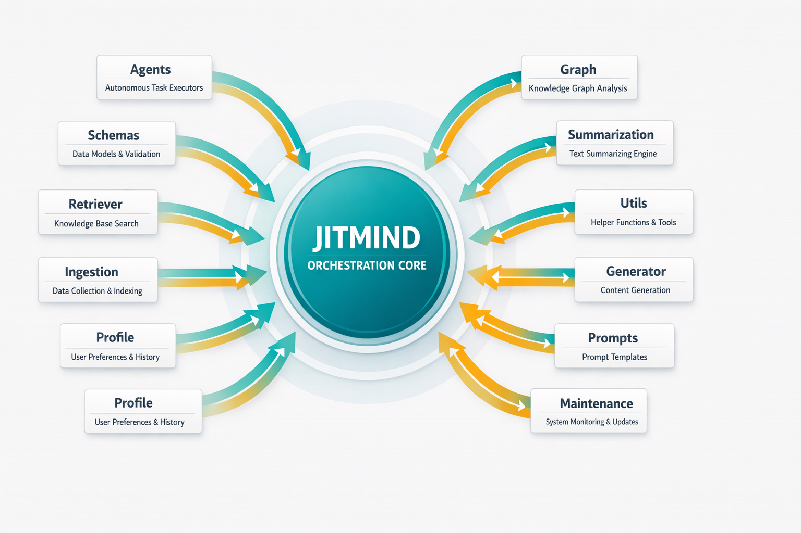
  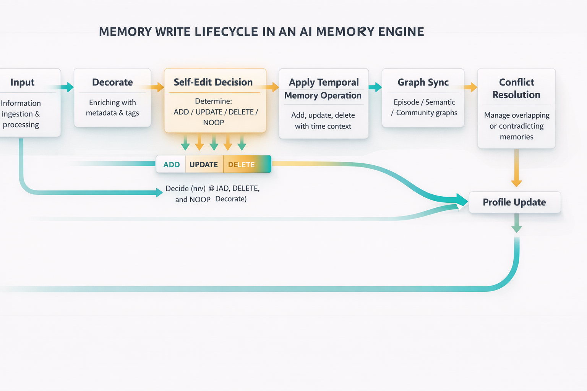
  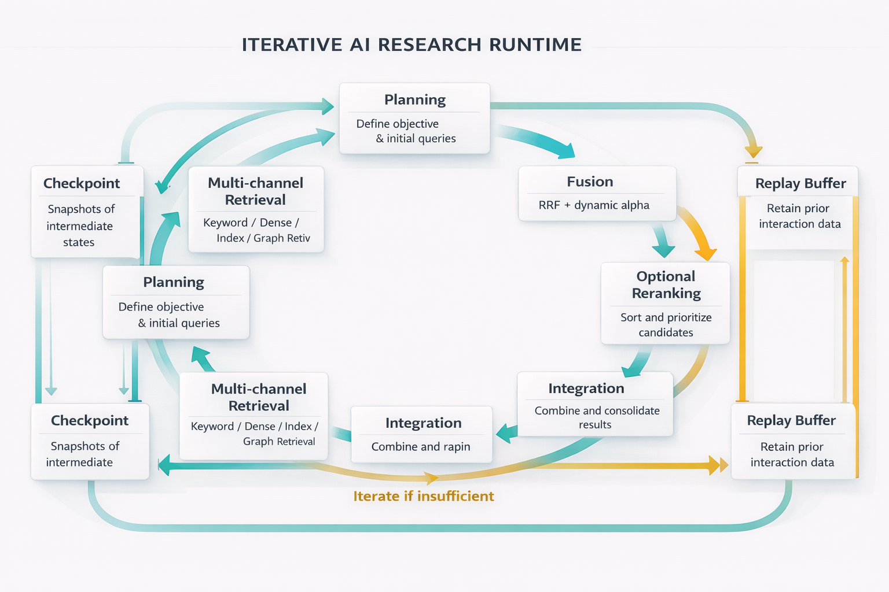
</p>
<p align="center">
  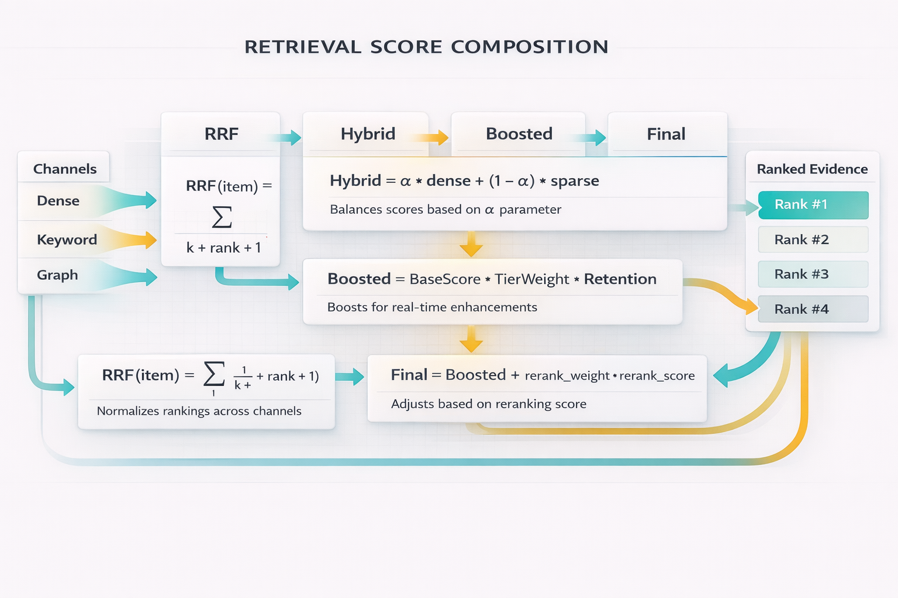
  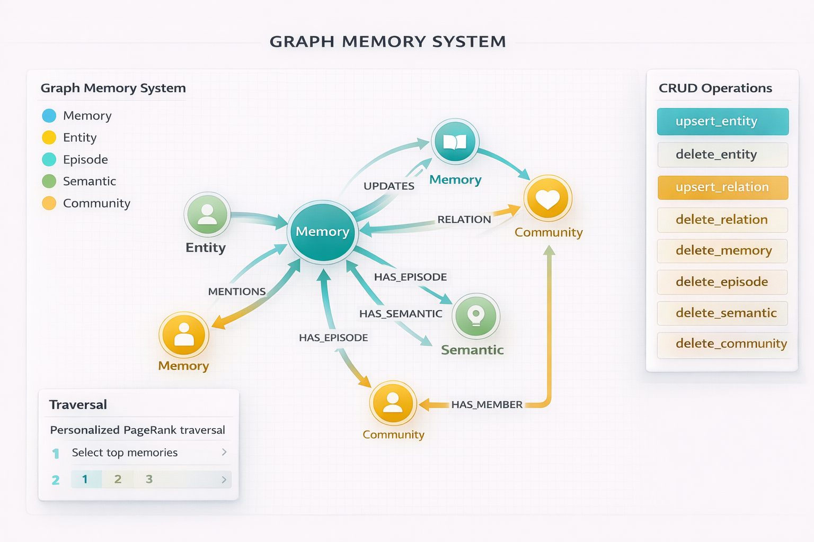
  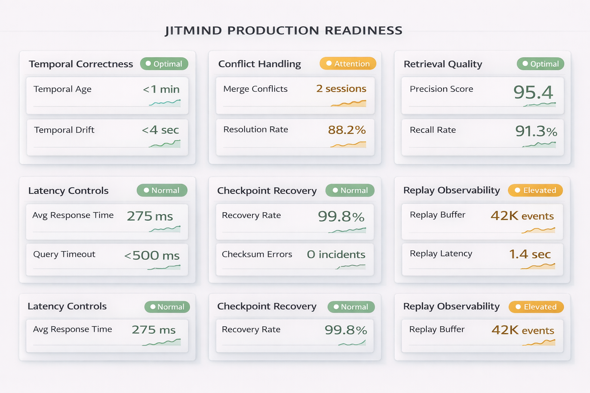
</p>

### 3.2 Package SVG Set (6 animated technical diagrams)

1) Package architecture map  
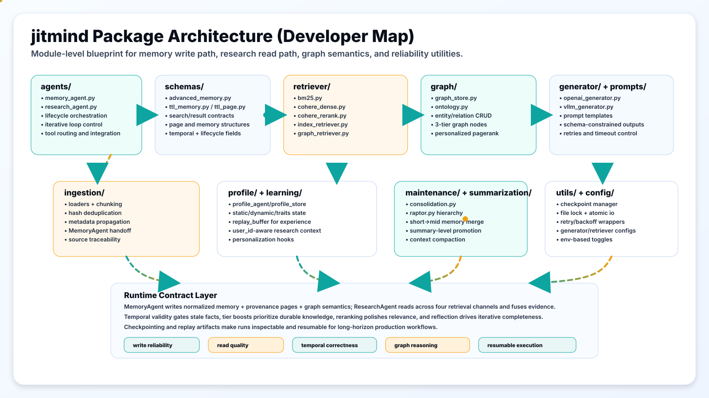

2) Memory write sequence  
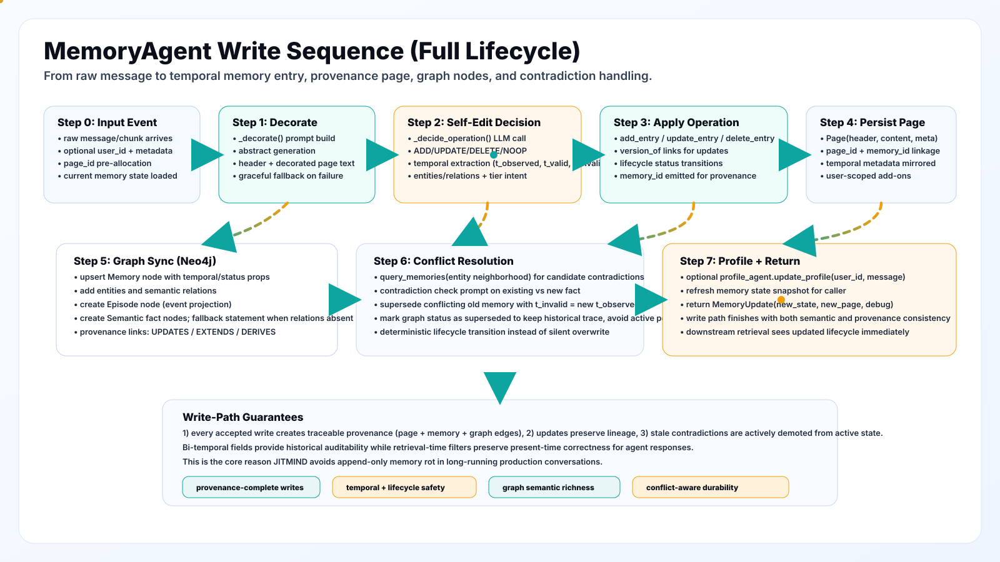

3) Research runtime sequence  


4) Schema relations map  
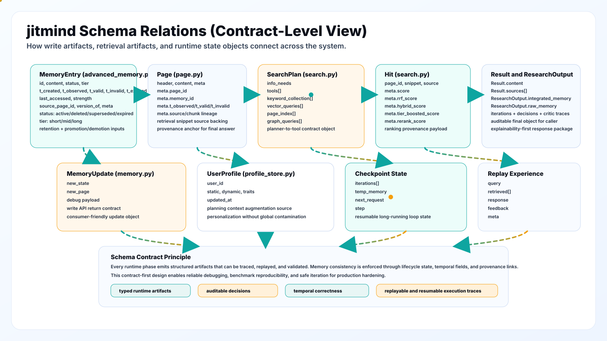

5) Retrieval scoring engine  
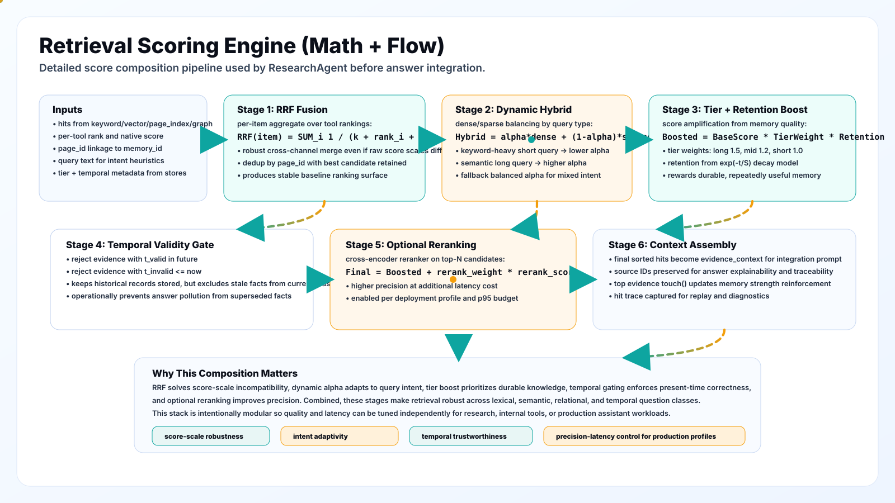

6) Graph semantics and CRUD  
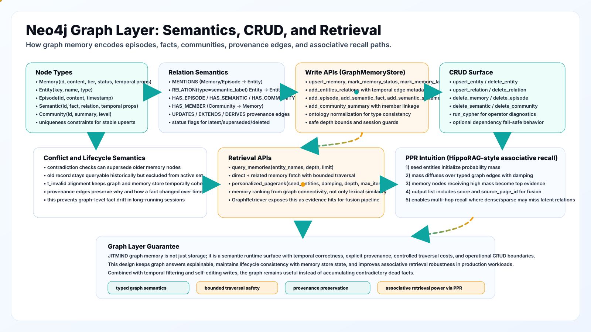

---

### 4. Package Scope and Philosophy

`jitmind/` is a memory runtime package for long-horizon agent systems.

The design premise is simple:

- A memory system that only appends facts will drift toward contradiction and noise.
- A memory system that ignores time will return stale facts.
- A memory system that relies on one retrieval method will fail on diverse query intents.

The package therefore combines:

- Explicit memory lifecycle operations.
- Bi-temporal fields and temporal filters.
- Hybrid retrieval channels and score fusion.
- Graph-based relational recall.
- Iterative plan/search/integrate/reflect answering.

---

### 5. Package Layout

```text
jitmind/
|-- __init__.py
|-- agents/
|   |-- memory_agent.py
|   `-- research_agent.py
|-- config/
|   |-- generator.py
|   `-- retriever.py
|-- evaluation/
|   `-- ragas_eval.py
|-- generator/
|   |-- base.py
|   |-- openai_generator.py
|   `-- vllm_generator.py
|-- graph/
|   |-- graph_store.py
|   |-- ontology.py
|   `-- utils.py
|-- ingestion/
|   |-- documents.py
|   |-- chunking.py
|   |-- loaders.py
|   `-- pipeline.py
|-- learning/
|   `-- replay_buffer.py
|-- maintenance/
|   `-- consolidation.py
|-- profile/
|   |-- profile_agent.py
|   `-- profile_store.py
|-- prompts/
|-- retriever/
|   |-- base.py
|   |-- bm25.py
|   |-- cohere_dense.py
|   |-- cohere_rerank.py
|   |-- dense_retriever.py
|   |-- graph_retriever.py
|   `-- index_retriever.py
|-- schemas/
|   |-- advanced_memory.py
|   |-- memory.py
|   |-- memory_ops.py
|   |-- page.py
|   |-- result.py
|   |-- search.py
|   |-- self_rag.py
|   |-- ttl_memory.py
|   `-- ttl_page.py
|-- summarization/
|   `-- raptor.py
`-- utils/
    |-- atomic_io.py
    |-- checkpoint.py
    |-- file_lock.py
    `-- retry.py
```

---

### 6. Public API Surface (`jitmind/__init__.py`)

The package root re-exports the primary runtime interfaces.

### Core agents

- `MemoryAgent`
- `ResearchAgent`

### Generators

- `AbsGenerator`
- `OpenAIGenerator`
- `VLLMGenerator`

### Retrievers

- `AbsRetriever`
- `IndexRetriever`
- `BM25Retriever` (optional import)
- `DenseRetriever` (optional import)
- `CohereDenseRetriever` (optional import)
- `CohereReranker` (optional import)
- `GraphRetriever`

### Stores and schemas

- `AdvancedMemoryStore`, `AdvancedMemoryState`, `MemoryEntry`
- `InMemoryMemoryStore`, `InMemoryPageStore`
- `TTLMemoryStore`, `TTLPageStore`
- `SearchPlan`, `Hit`, `Result`, `ResearchOutput`
- `MemoryState`, `Page`, `MemoryUpdate`

### Graph interfaces

- `GraphMemoryStore`
- `GraphOntology`

### Ingestion interfaces

- `Document`, `Chunk`
- `BaseLoader` and concrete loaders
- `BaseChunker`, `SimpleChunker`, `ChunkingConfig`
- `IngestionPipeline`

### Optional higher-level modules

- `UserProfileStore`, `UserProfileAgent`
- `HierarchicalSummarizer`
- `MemoryConsolidator`
- `CheckpointManager`
- `ExperienceReplayBuffer`
- `RAGASEvaluator`

---

### 7. Core Architectural Pattern

At runtime, the package splits responsibilities:

- Write intelligence: `MemoryAgent`
- Read intelligence: `ResearchAgent`

This split is intentional.

Write path goals:

- normalize information into durable state
- manage lifecycle semantics
- preserve provenance
- synchronize graph facts

Read path goals:

- plan and gather evidence across retrieval channels
- rank and filter evidence using quality constraints
- synthesize grounded output
- iterate until sufficient confidence

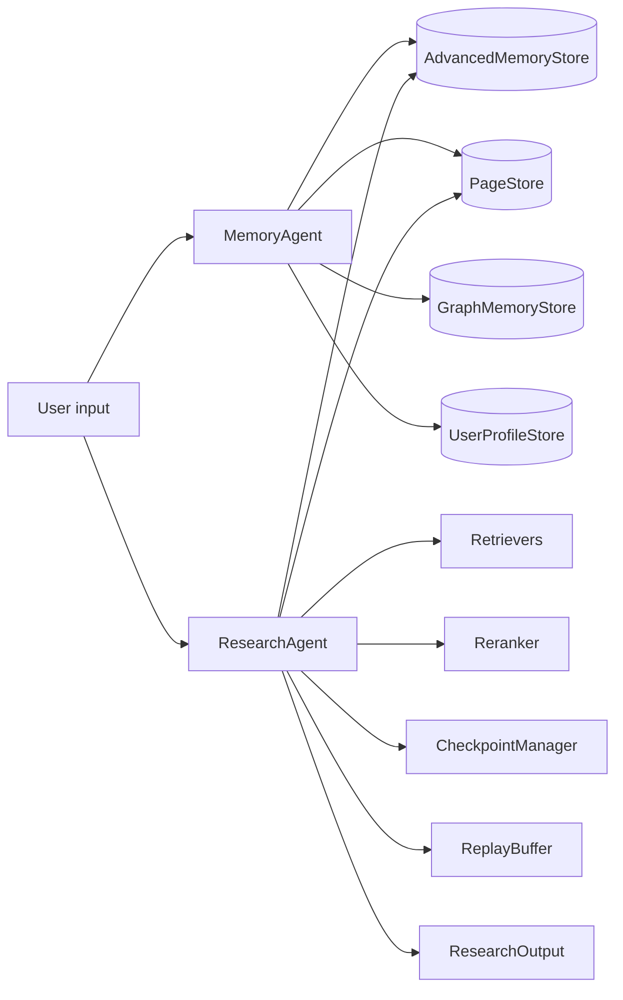

---

### 8. Data Contracts and Invariants

### 8.1 `MemoryEntry` (`schemas/advanced_memory.py`)

`MemoryEntry` is the system's canonical long-term memory object.

Key fields:

- identity and status
  - `id`
  - `status` in `{active, deleted, superseded, expired}`
  - `tier` in `{short, mid, long}`

- temporal fields
  - `t_created`
  - `t_observed`
  - `t_valid`
  - `t_invalid`
  - `t_expired`

- quality fields
  - `last_accessed`
  - `strength`

- linkage
  - `source_page_id`
  - `version_of`
  - `meta`

Invariant expectations:

- `id` is stable and unique.
- non-active statuses should not be returned in active retrieval sets.
- updates should retain lineage via `version_of` and status transitions.
- temporal fields are optional but must be ISO-compatible when present.

### 8.2 `Page` (`schemas/page.py`)

`Page` stores provenance-rich content.

Important metadata keys:

- `page_id`
- `memory_id`
- `t_observed`, `t_valid`, `t_invalid`
- source/chunk lineage keys from ingestion

### 8.3 Search contracts (`schemas/search.py`, `schemas/result.py`)

- `SearchPlan`: planner output with channel-specific query arrays.
- `Hit`: retrieval candidate with source label and score metadata.
- `Result`: intermediate integrated text and source IDs.
- `ResearchOutput`: final return object with `integrated_memory` and `raw_memory` trace.

### 8.4 Reliability contracts

- `CheckpointManager` state payload captures iteration continuity.
- `ExperienceReplayBuffer` records query/retrieval/response/feedback tuples.

---

### 9. Memory Write Path Deep Dive (`agents/memory_agent.py`)

### 9.1 Public entrypoint

`memorize(message, meta=None, user_id=None) -> MemoryUpdate`

### 9.2 Step-by-step behavior

1. Normalize input and load current memory state.
2. Call `_decorate`:
   - build memory context string
   - generate abstract from prompt
   - produce page header and decorated text
3. Call `_decide_operation`:
   - structured decision over ADD/UPDATE/DELETE/NOOP
   - temporal extraction and relation extraction
4. Call `_apply_memory_operation`:
   - write/update/delete in `AdvancedMemoryStore`
   - produce memory id when applicable
5. Persist `Page` with metadata linkage to memory object.
6. If graph enabled:
   - upsert memory node
   - write entities and relations
   - write episode node
   - write semantic fact nodes
   - write provenance edges (`UPDATES`, `EXTENDS`, etc.)
7. Run contradiction checks and supersede stale facts.
8. Optionally update user profile.
9. Return updated state plus new page and debug metadata.

### 9.3 Why this is stronger than append-only memory

- contradictions can be resolved instead of accumulating
- lifecycle state changes are explicit and auditable
- temporal windows are captured during write, enabling safe read filtering

### 9.4 Core risks to monitor

- malformed operation outputs from model
- over-aggressive conflict detection
- missing temporal fields reducing filter precision

---

### 10. Research Path Deep Dive (`agents/research_agent.py`)

### 10.1 Public entrypoints

- `research(...)`
- `research_async(...)`

### 10.2 Iterative runtime loop

For each iteration:

1. `_planning` produces a typed `SearchPlan`.
2. `_search` executes planned channels and gathers hits.
3. Score fusion and filtering produce final evidence order.
4. `_integrate` synthesizes grounded content from evidence.
5. `_self_rag_reflect` checks relevance/support/usefulness.
6. `_reflection` decides `enough` vs `new_request`.
7. Loop continues until enough or `max_iters` reached.

### 10.3 Optional runtime capabilities

- HyDE query expansion (`enable_hyde`)
- Self-RAG critic (`enable_self_rag`)
- Dynamic sparse/dense weighting (`enable_dynamic_alpha`)
- Reflection learning (`enable_reflection_learning`)
- Checkpoint save/load
- Replay buffer writes

### 10.4 Context pressure handling

`_build_memory_context` can trim context using token pressure thresholds.

This avoids uncontrolled prompt growth and keeps planning stable.

---

### 11. Retrieval and Ranking Engine

### 11.1 Channels

- `keyword`: BM25
- `vector`: dense embedding retrieval
- `page_index`: deterministic direct lookup
- `graph`: relation-driven retrieval with optional PPR

### 11.2 Score composition pipeline

1. RRF baseline fusion:

`RRF(item) = SUM_i 1 / (k + rank_i + 1)`

2. Dynamic hybrid score when sparse+dense both present:

`Hybrid = alpha * dense + (1 - alpha) * sparse`

3. Tier and retention boost:

`Boosted = BaseScore * TierWeight * Retention`

4. Optional reranking:

`Final = Boosted + rerank_weight * rerank_score`

5. Temporal validity filtering before final integration.

### 11.3 Why this composition works

- RRF handles heterogeneous score scales.
- Dynamic alpha adapts to query intent.
- Tier retention keeps durable knowledge prioritized.
- Temporal filters reduce stale-answer risk.
- Reranking improves precision when latency budget allows.

---

### 12. Bi-Temporal Semantics

The package distinguishes at least two conceptually separate times:

- observation/recording time
- factual validity window

Relevant fields:

- `t_created`: when memory was persisted
- `t_observed`: when evidence was observed
- `t_valid`: validity start
- `t_invalid`: validity end
- `t_expired`: lifecycle expiration

Read-time filtering in `_filter_temporal_hits` drops:

- facts not yet valid
- facts already invalid

This is critical for preventing historical but stale facts from polluting present answers.

---

### 13. Self-Editing and Conflict Resolution

Memory operations are lifecycle-aware:

- `ADD`: create active entry
- `UPDATE`: supersede target, append new version
- `DELETE`: mark target deleted
- `NOOP`: skip redundant write

Conflict strategy:

- find nearby candidate memories through graph neighborhood
- run contradiction check prompt
- supersede old conflicting records with invalidation timestamp

Expected benefit:

- controlled memory evolution over long sessions
- lower contradiction rate in retrieved evidence

---

### 14. Hierarchical Memory and Decay

`AdvancedMemoryStore` includes tiering and forgetting mechanics.

### Tier semantics

- `short`: fresh or weakly reinforced
- `mid`: reinforced and retained
- `long`: durable high-value memory

### Retention function

`R = exp(-t / S)`

- `t`: time since last access (days)
- `S`: strength

### Promotion and demotion

- promotions require age/strength criteria
- demotions happen under inactivity and retention thresholds

### Cleanup

`cleanup_expired()` purges non-active records to prevent state bloat.

---

### 15. Graph Subsystem (`graph/graph_store.py`)

### 15.1 Node classes

- `Memory`
- `Entity`
- `Episode`
- `Semantic`
- `Community`

### 15.2 Semantics

- relation labels include both structural and provenance links
- temporal properties can be attached at relation/fact level
- ontology normalization can constrain relation/entity vocabulary

### 15.3 CRUD and operator surface

Write/update helpers:

- `upsert_memory`
- `mark_memory_status`
- `mark_memory_latest`
- `link_memory_relation`
- `add_entities_relations`
- `add_episode`
- `add_semantic_fact`
- `add_semantic_statement`
- `add_community_summary`

Delete helpers:

- `delete_entity`
- `delete_relation`
- `delete_memory`
- `delete_episode`
- `delete_semantic`
- `delete_community`

Query helpers:

- `query_memories`
- `personalized_pagerank`
- `run_cypher`

### 15.4 PPR retrieval intuition

Personalized PageRank starts from seed entities and diffuses score over the subgraph. High-score memory nodes become associative evidence candidates.

This supports multi-hop recall beyond lexical overlap.

---

### 16. Ingestion Pipeline (`ingestion/pipeline.py`)

`IngestionPipeline` handles loader fan-in and chunk processing.

Core behavior:

- load documents from one or more loaders
- chunk via configured chunker
- deduplicate chunks via content hash
- pass each chunk to `MemoryAgent.memorize`
- preserve source metadata in page records

This makes ingestion deterministic and traceable.

---

### 17. User Profile Subsystem (`profile/`)

`UserProfileStore` persists per-user profile JSON.

Profile dimensions:

- `static`: stable preferences/facts
- `dynamic`: short-horizon context
- `traits`: long-horizon behavior cues

`UserProfileAgent` uses prompt-based extraction to update profile fields.

`ResearchAgent` can inject profile context into planning when `user_id` is present.

---

### 18. Maintenance and Summarization

### 18.1 Consolidation (`maintenance/consolidation.py`)

- embed active short-tier memories
- cluster by similarity threshold
- summarize cluster into mid-tier merged entry
- supersede original cluster members

### 18.2 Hierarchical summarization (`summarization/raptor.py`)

- level 0: raw entries
- level 1: cluster summaries
- level 2: summary-of-summaries
- level 3: global summary

This helps preserve semantic breadth while reducing context footprint.

---

### 19. Reliability Utilities (`utils/`)

### 19.1 Atomic and lock-safe persistence

- `atomic_io.py` for atomic JSON writes
- `file_lock.py` for file-based synchronization

### 19.2 Checkpointing

- `checkpoint.py` stores and restores iterative run state

### 19.3 Retry wrappers

- `retry.py` provides backoff and jitter wrappers for provider calls

Operational value:

- fewer partial-write corruption risks
- safer concurrent writes
- better recovery from transient provider failures

---

### 20. Configuration Reference

Environment variables used directly in package code:

- `OPENROUTER_API_KEY`
- `OPENROUTER_BASE_URL`
- `OPENAI_API_KEY`
- `OPENAI_BASE_URL`
- `COHERE_API_KEY`
- `COHERE_BASE_URL`
- `COHERE_EMBED_MODEL`
- `COHERE_EMBED_INPUT_TYPE_DOC`
- `COHERE_EMBED_INPUT_TYPE_QUERY`
- `COHERE_RERANK_MODEL`
- `NEO4J_URI`
- `NEO4J_USERNAME`
- `NEO4J_PASSWORD`
- `NEO4J_DATABASE`
- `GRAPH_ENTITY_TYPES`
- `GRAPH_RELATION_TYPES`
- `GRAPH_ALLOW_UNKNOWN`

High-impact constructor knobs:

`ResearchAgent`:

- `max_iters`
- `rrf_k`
- `rerank_top_n`
- `rerank_weight`
- `enable_hyde`
- `enable_self_rag`
- `enable_dynamic_alpha`
- `enable_reflection_learning`
- `max_context_tokens`
- `context_warning_threshold`

`AdvancedMemoryStore`:

- `ttl_seconds`
- `retention_threshold`
- promotion thresholds
- demotion thresholds

---

### 21. Quickstart (Package-Focused)

### 21.1 Install and bootstrap

```bash
python3 -m venv .venv
source .venv/bin/activate
python3 -m pip install --upgrade pip
pip install -e .
pip install openai cohere neo4j faiss-cpu numpy pydantic tqdm scikit-learn pytest
```

Optional sparse dependency:

```bash
pip install pyserini
```

### 21.2 Export required env vars

```bash
export OPENROUTER_API_KEY="..."
export OPENROUTER_BASE_URL="https://openrouter.ai/api/v1"

export COHERE_API_KEY="..."
export COHERE_BASE_URL="https://api.cohere.com"

export NEO4J_URI="neo4j+s://<your-instance>.databases.neo4j.io"
export NEO4J_USERNAME="neo4j"
export NEO4J_PASSWORD="..."
export NEO4J_DATABASE="neo4j"
```

### 21.3 Minimal end-to-end package usage

```python
import os
from jitmind import (
    MemoryAgent,
    ResearchAgent,
    OpenAIGenerator,
    OpenAIGeneratorConfig,
    AdvancedMemoryStore,
    InMemoryPageStore,
    IndexRetriever,
    IndexRetrieverConfig,
    CohereDenseRetriever,
    CohereEmbedRetrieverConfig,
    CohereReranker,
    CohereRerankerConfig,
)

# Generator
cfg = OpenAIGeneratorConfig(
    model_name="google/gemini-3-flash-preview",
    api_key=os.getenv("OPENROUTER_API_KEY"),
    base_url=os.getenv("OPENROUTER_BASE_URL", "https://openrouter.ai/api/v1"),
    temperature=0.0,
    max_tokens=512,
)
generator = OpenAIGenerator.from_config(cfg)

# Stores
memory_store = AdvancedMemoryStore()
page_store = InMemoryPageStore()

# Writer
memory_agent = MemoryAgent(
    generator=generator,
    memory_store=memory_store,
    page_store=page_store,
)

memory_agent.memorize("Alice moved to Berlin in 2024.", user_id="alice")
memory_agent.memorize("Alice now works at Orbital Systems.", user_id="alice")

# Retrievers
retrievers = {}
index_retriever = IndexRetriever(IndexRetrieverConfig(index_dir="./index/index").__dict__)
index_retriever.build(page_store)
retrievers["page_index"] = index_retriever

try:
    dense_retriever = CohereDenseRetriever(
        CohereEmbedRetrieverConfig(
            index_dir="./index/cohere_dense",
            api_key=os.getenv("COHERE_API_KEY"),
        ).__dict__
    )
    dense_retriever.build(page_store)
    retrievers["vector"] = dense_retriever
except Exception as e:
    print("Dense retriever disabled:", e)

reranker = None
try:
    reranker = CohereReranker(CohereRerankerConfig(api_key=os.getenv("COHERE_API_KEY")).__dict__)
except Exception as e:
    print("Reranker disabled:", e)

# Reader
research_agent = ResearchAgent(
    page_store=page_store,
    memory_store=memory_store,
    retrievers=retrievers,
    generator=generator,
    reranker=reranker,
    max_iters=3,
    enable_hyde=True,
    enable_self_rag=True,
    enable_dynamic_alpha=True,
    enable_reflection_learning=True,
)

out = research_agent.research(
    request="Where does Alice work now and what changed?",
    user_id="alice",
)

print(out.integrated_memory)
```

### 21.4 Async entrypoint example

```python
import asyncio

async def run_async(agent):
    result = await agent.research_async(
        request="Summarize current facts and confidence level.",
        checkpoint_id="thread_001",
        resume=True,
        user_id="alice",
    )
    print(result.integrated_memory)

# asyncio.run(run_async(research_agent))
```

---

### 22. Developer Workflow Patterns

### Pattern A: Memory-only service

Use `MemoryAgent` + `AdvancedMemoryStore` + `InMemoryPageStore` when only write and structured state are required.

### Pattern B: Retrieval-only service over existing memory

Load memory/page state and instantiate `ResearchAgent` with retrievers. Skip `MemoryAgent` in read-only mode.

### Pattern C: Full closed-loop agent

Use both agents with graph enabled, reranker enabled, and reflection learning enabled.

### Pattern D: Cost-sensitive mode

Disable HyDE and reranker, reduce `max_iters`, keep keyword and index channels active.

---

### 23. Extension Recipes

### 23.1 Add a custom retriever

Requirements:

- implement base retriever interface methods: `build`, `load`, `update`, `search`
- return `List[List[Hit]]` with complete metadata
- register in `ResearchAgent.retrievers`

### 23.2 Add a custom generator backend

Requirements:

- implement `AbsGenerator` methods
- support `generate_single` and optionally `generate_batch`
- return structured output format consistent with package expectations

### 23.3 Add a custom chunking strategy

Requirements:

- subclass `BaseChunker`
- output `Chunk` objects with stable ids and metadata
- plug into `IngestionPipeline(chunker=...)`

### 23.4 Add new graph relation semantics

Requirements:

- extend ontology normalization map
- ensure relation typing remains stable (`RELATION` + `type` property pattern)
- add tests for query and traversal behavior

---

### 24. Testing and Verification

Current tests in repository primarily focus on TTL and persistence behavior.

Run all current tests:

```bash
python3 -m pytest tests -v
```

Recommended high-priority additions:

1. Contract tests for memory operation decisions.
2. Temporal gate tests with synthetic validity windows.
3. Graph CRUD and PPR regression tests.
4. End-to-end retrieval scoring order tests on fixed fixtures.
5. Async resume tests for checkpoint consistency.

---

### 25. Performance and Cost Tuning

### If latency is too high

- reduce `max_iters`
- disable reranker or lower `rerank_top_n`
- disable HyDE
- lower retrieval `top_k`
- keep graph traversal depth conservative

### If answer quality is weak

- enable HyDE
- keep Self-RAG enabled
- increase iteration budget moderately
- enable reranker with tuned weight
- improve ingestion chunk quality and metadata consistency

### If memory grows too fast

- tighten retention threshold
- run consolidation regularly
- tune self-edit prompts to increase NOOP on duplicates
- adjust promotion thresholds

---

### 26. Operational Guardrails

### Security

- never hardcode API keys in source
- keep secrets in environment or secret manager
- restrict logs that might include user content

### Data hygiene

- monitor status distribution (`active`, `superseded`, `deleted`, `expired`)
- monitor conflict supersession rates
- monitor graph growth and relation density

### Observability

Track:

- per-stage latency (plan/search/fuse/integrate/reflect)
- per-channel hit contribution
- temporal filter drop rate
- reranker lift vs latency delta

---

### 27. Failure Modes and Troubleshooting

### Symptom: old facts still appear in answers

Checks:

- verify temporal fields are present in page metadata
- verify `_filter_temporal_hits` is running
- verify contradictory entries are actually marked superseded/deleted

### Symptom: graph retrieval returns little value

Checks:

- entity extraction quality
- relation normalization quality
- graph depth and PPR settings
- missing Neo4j env vars

### Symptom: unstable retrieval ranking

Checks:

- inspect RRF and hybrid score fields in hit metadata
- verify tier boost requires valid memory_id linkage
- compare reranker on/off behavior and weights

### Symptom: memory store corruption risks under concurrency

Checks:

- ensure file lock usage paths are active
- ensure atomic writes are not bypassed
- avoid manual edits to JSON state while services are running

---

### 28. Package Maturity Snapshot

Strengths:

- strong conceptual architecture
- concrete lifecycle and temporal semantics
- hybrid retrieval with explainable score composition
- graph semantics beyond flat vector memory

Current practical constraints:

- test suite breadth can be expanded beyond TTL-heavy coverage
- packaging/dependency ergonomics can be improved with unified manifest
- benchmark automation can be expanded and pinned for reproducibility

---

### 29. Developer Checklist Before Merging Package Changes

1. Does change preserve schema compatibility and lifecycle invariants?
2. Does change keep retrieval score semantics interpretable?
3. Are temporal fields handled consistently in write and read paths?
4. If graph code changed, are CRUD/query/PPR paths still coherent?
5. Are failure paths safe under missing optional dependencies?
6. Are tests updated or added where behavior changed?

---

### 30. Companion Documentation

- Root project overview: `../README.md`
- Deep implementation note: `../IMPLEMENTATION_DEEP_DIVE.md`
- V2 implementation note: `../IMPLEMENTATION_DEEP_DIVE_V2.md`

---

<a id="license"></a>
## 📄 License

MIT License. See `../LICENSE`.

---

<a id="acknowledgments"></a>
## 🙏 Acknowledgments

Thanks to the open-source ecosystem that makes modern Python + LLM tooling possible.

---

<a id="support"></a>
## 📞 Support

- Repo: `github.com/DivyamTalwar/JITMIND`
- Author: Divyam Talwar (`github.com/DivyamTalwar`)
- Bugs/requests: open a GitHub issue with repro steps, logs, and your config (redact secrets)
