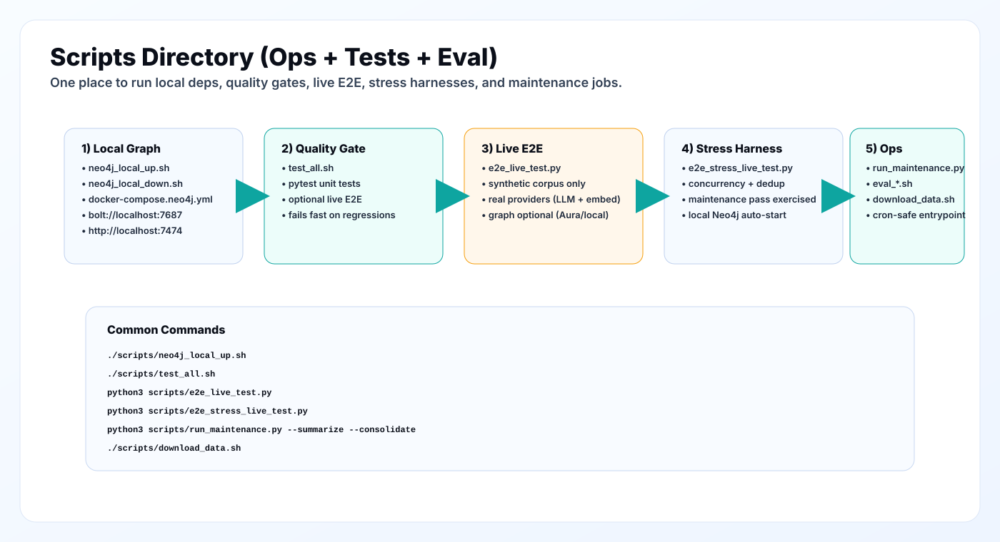

# Scripts Directory

This folder contains operational scripts for running JITMIND locally: dependency setup (Neo4j), test gates, live end-to-end harnesses, evaluation wrappers, and cron-safe maintenance jobs.



## What You Can Do Here

- Start/stop a local Neo4j instance for graph memory development.
- Run unit tests + an optional live E2E sanity check in one command.
- Run a deterministic live E2E test that hits real providers using only synthetic data.
- Run a heavier stress harness that exercises concurrency, ingestion deduplication, maintenance, and graph readiness.
- Download datasets and trigger benchmark evaluation scripts (when datasets are available).
- Run consolidation and hierarchical summarization as a cron job.

## Files

- `neo4j_local_up.sh`
  - Starts Neo4j locally via `docker compose -f docker-compose.neo4j.yml up -d`.
  - Default ports:
    - Browser UI: `http://localhost:7474`
    - Bolt: `bolt://localhost:7687`
- `neo4j_local_down.sh`
  - Stops Neo4j and removes volumes (destructive for local data).
- `test_all.sh`
  - Runs unit tests (`pytest`) and then optionally runs a live E2E test if API keys exist.
- `e2e_live_test.py`
  - Live end-to-end harness that hits real providers.
  - Uses synthetic test data only.
  - Writes run artifacts under `.tmp_e2e/` (gitignored).
- `e2e_stress_live_test.py`
  - Live stress harness:
    - parallel async research calls
    - ingestion deduplication check
    - maintenance pass (summaries + consolidation)
    - graph readiness + resilience checks
  - Writes run artifacts under `.tmp_e2e_stress/` (gitignored).
- `download_data.sh`
  - Downloads datasets used by evaluation scripts.
  - Some dataset URLs are intentionally environment-driven so the repo does not hardcode external hubs.
- `eval_hotpotqa.sh`, `eval_locomo.sh`, `eval_narrativeqa.sh`, `eval_ruler.sh`
  - Convenience wrappers around benchmark evaluation entrypoints.
- `run_maintenance.py`
  - Cron-safe maintenance runner for:
    - sleep-time consolidation
    - hierarchical summarization
  - Designed to run from `scripts/` without requiring `pip install -e .`.

## Quickstart

### 1) Start local graph memory (optional)

```bash
./scripts/neo4j_local_up.sh

export NEO4J_URI="bolt://localhost:7687"
export NEO4J_USERNAME="neo4j"
export NEO4J_PASSWORD="jitmind_local_password"
export NEO4J_DATABASE="neo4j"
```

### 2) Run unit tests + optional live E2E

```bash
./scripts/test_all.sh
```

### 3) Run live E2E directly

```bash
python3 scripts/e2e_live_test.py
```

### 4) Run stress harness

```bash
python3 scripts/e2e_stress_live_test.py
```

### 5) Run maintenance job (cron-safe)

```bash
python3 scripts/run_maintenance.py --summarize --consolidate --data-dir ./data
```

## Environment Variables

Most scripts do not require a `.env` file; they read environment variables.

Required for live provider calls:

- `OPENROUTER_API_KEY`
- `OPENROUTER_BASE_URL` (optional, default: `https://openrouter.ai/api/v1`)
- `OPENROUTER_MODEL` (optional, default: `google/gemini-3-flash-preview`)
- `COHERE_API_KEY`
- `COHERE_BASE_URL` (optional, default: `https://api.cohere.com`)
- `COHERE_EMBED_MODEL` (optional)
- `COHERE_RERANK_MODEL` (optional)

Graph (optional but recommended for full feature coverage):

- `NEO4J_URI`
- `NEO4J_USERNAME`
- `NEO4J_PASSWORD`
- `NEO4J_DATABASE` (optional, default: `neo4j`)

## Safety Notes

- `neo4j_local_down.sh` runs `docker compose ... down -v`, which removes local Neo4j volumes.
- `e2e_*` scripts create and delete per-run directories under `.tmp_e2e/` and `.tmp_e2e_stress/`.
- Never print or commit secrets. Keep provider keys in your environment or a local secret manager.

