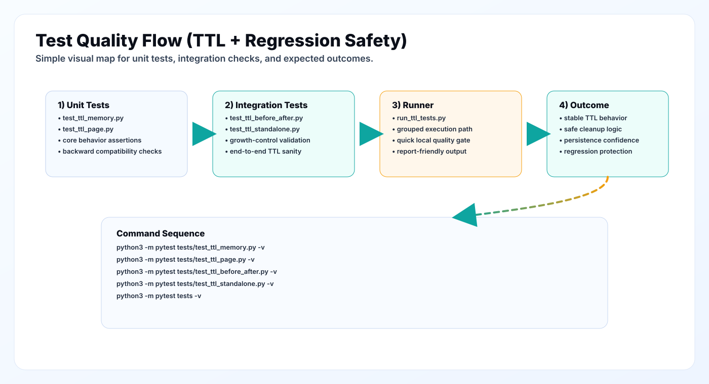

# Tests Directory

This folder contains the current automated validation suite, focused primarily on TTL and persistence behavior.



## Goals of Current Tests

1. Verify TTL stores enforce expiry behavior correctly.
2. Verify cleanup operations keep state bounded.
3. Verify persistence survives reloads.
4. Verify backward-compatibility behavior for stored formats.

## Test Inventory

### Unit-level tests

- `test_ttl_memory.py`
  - `TTLMemoryStore` behavior, expiration, stats, compatibility checks
- `test_ttl_page.py`
  - `TTLPageStore` behavior, timestamp metadata, retrieval and stats

### Integration-style tests

- `test_ttl_before_after.py`
  - demonstrates growth behavior with and without TTL controls
- `test_ttl_standalone.py`
  - direct module-level TTL validation script

### Utility runner

- `run_ttl_tests.py`
  - grouped execution helper for TTL-focused checks

## Running Tests

From repository root:

```bash
python3 -m pytest tests -v
```

Run targeted files:

```bash
python3 -m pytest tests/test_ttl_memory.py -v
python3 -m pytest tests/test_ttl_page.py -v
python3 -m pytest tests/test_ttl_before_after.py -v
python3 -m pytest tests/test_ttl_standalone.py -v
```

Optional runner:

```bash
python3 tests/run_ttl_tests.py
```

## Environment Setup

```bash
python3 -m venv .venv
source .venv/bin/activate
pip install -e .
pip install pytest
```

## Expected Outcome

Healthy run should show:

- no uncaught exceptions
- expected expiry behavior
- accurate stats and cleanup counts
- successful persistence reload behavior

## Current Coverage and Gaps

Strong coverage today:

- TTL core behavior
- persistence mechanics
- basic regression safety for expiry logic

Still recommended:

1. Contract tests for memory operation lifecycle (`ADD/UPDATE/DELETE/NOOP`).
2. Temporal filtering tests for `t_valid` and `t_invalid`.
3. Graph CRUD and PPR regression tests.
4. Retrieval fusion/ranking order tests on fixed fixtures.
5. Async checkpoint resume tests.

